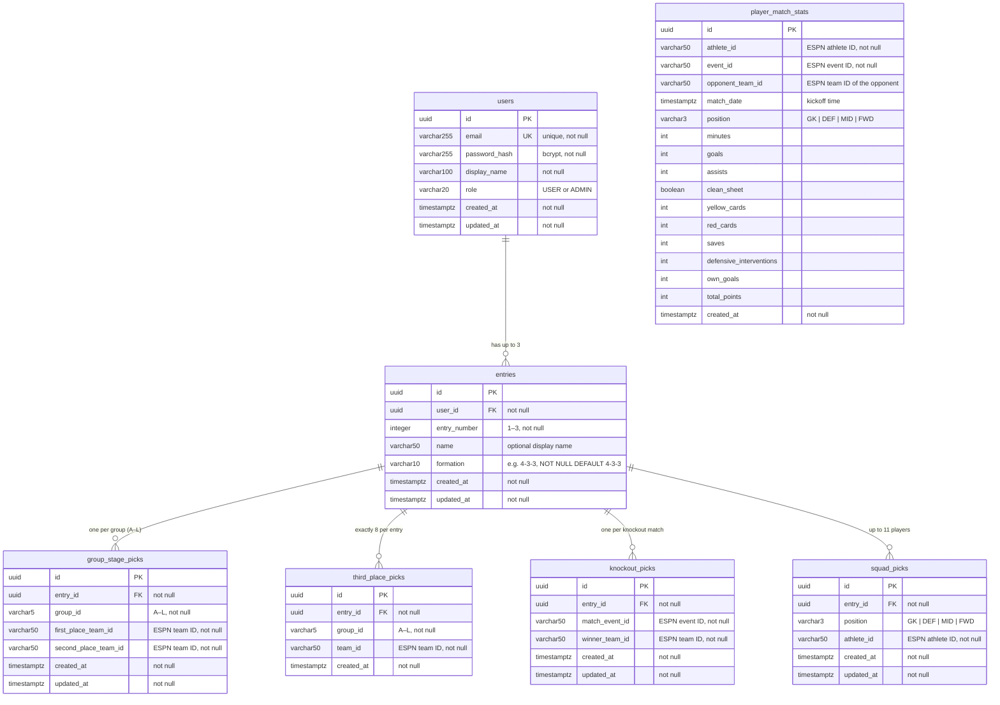

# World Cup App – Backend

Spring Boot REST API that proxies live World Cup data to the React frontend and persists user accounts, entries, and tournament picks in PostgreSQL. The ESPN data source is behind an interface so any provider can be swapped in without touching the controllers.

---

## Requirements

| Tool | Minimum Version |
|------|----------------|
| Java | 17 |
| Maven | 3.8 |
| PostgreSQL | 14 *(production/staging only – not needed for local dev)* |

No API keys are required for the default ESPN provider.

---

## Running Locally (no PostgreSQL required)

The `local` Spring profile replaces PostgreSQL with an H2 in-memory database and seeds test accounts on startup. No environment variables are needed.

```bash
cd backend
mvn spring-boot:run -Dspring-boot.run.profiles=local
```

**IntelliJ:** Run config → Active profiles → `local`

The server starts on port **8080**.

#### Seed data modes

Two seeders run on startup (in order):

1. **`DataInitializer`** — always creates `player1@test.com` and `player2@test.com` with password `password`. `player1` has a full set of sample picks; `player2` has no entries (useful for testing the blank state in the UI).

2. **`MockDataSeeder`** — controlled by `app.mock.data-mode` in `application-local.properties`:

| Mode | What gets seeded |
|------|-----------------|
| `NONE` *(default)* | Nothing — only DataInitializer's 2 test users |
| `GROUP_STAGE` | 12 mock users (`user01@mock.wc26` … `user12@mock.wc26`) with 1–3 entries each, group-stage picks, third-place picks, and squad picks. No knockout picks. Use this mode to test the bracket-picks UI before the knockout stage. |
| `FULL` | Everything in `GROUP_STAGE` plus knockout picks and player match stats with FPL fantasy points. Use this mode to test the leaderboard. |

Mock user credentials: `user01@mock.wc26` through `user12@mock.wc26`, password `password`.

To activate a mode, edit `backend/src/main/resources/application-local.properties`:

```properties
app.mock.data-mode=FULL
```

### H2 Browser Console

While running with the `local` profile, the H2 web console is available at:

```
http://localhost:8080/h2-console
```

| Field | Value |
|-------|-------|
| JDBC URL | `jdbc:h2:mem:worldcupapp` |
| User | `sa` |
| Password | *(leave empty)* |

---

## Running Against PostgreSQL

Set the following environment variables before starting, then run without a profile:

```bash
export DB_HOST=localhost
export DB_PORT=5432
export DB_NAME=worldcupapp
export DB_USERNAME=worldcupapp
export DB_PASSWORD=yourpassword
export JWT_SECRET=<base64-encoded-256-bit-key>

mvn spring-boot:run
```

Flyway runs automatically on startup and applies any pending migrations from `src/main/resources/db/migration/`.

### AWS Deployment (EC2 + Docker + CloudFront)

The backend runs as a Docker container on an EC2 t3.micro instance. Nginx on the same instance proxies port 80 → `127.0.0.1:8080`. A dedicated CloudFront distribution with an HTTP origin points at the EC2 public DNS name, providing free HTTPS at `*.cloudfront.net` without a custom domain or ACM certificate.

Environment variables are passed as `-e` flags in the `docker run` command (see `.github/workflows/deploy.yaml`):

| Environment variable | Description |
|----------------------|-------------|
| `DB_HOST` | RDS endpoint hostname |
| `DB_PORT` | Database port (default `5432`) |
| `DB_NAME` | Database name |
| `DB_USERNAME` | Database user |
| `DB_PASSWORD` | Database password |
| `JWT_SECRET` | Base64-encoded HMAC-SHA key (≥ 256 bits) — generate with `openssl rand -base64 32` |
| `JWT_EXPIRATION_MS` | Token lifetime in ms (default `86400000` = 24 h) |
| `APP_CORS_ALLOWED_ORIGINS` | CloudFront frontend URL, e.g. `https://xxxx.cloudfront.net` |
| `FRONTEND_URL` | Same CloudFront URL — used in bracket-reminder email CTA link |
| `MAIL_HOST` | SES SMTP endpoint, e.g. `email-smtp.us-east-1.amazonaws.com` |
| `MAIL_PORT` | SMTP port (`587` for STARTTLS) |
| `MAIL_USERNAME` | SES SMTP username (from SES → SMTP settings, **not** an IAM access key) |
| `MAIL_PASSWORD` | SES SMTP password |
| `MAIL_SMTP_AUTH` | `true` for SES |
| `MAIL_SMTP_STARTTLS` | `true` for SES |
| `MAIL_FROM_ADDRESS` | Verified sender address in SES, e.g. `noreply@yourdomain.com` |

---

## Configuration Reference

| Property | Default | Description |
|----------|---------|-------------|
| `server.port` | `8080` | HTTP port |
| `management.server.port` | `9090` (prod) / `8080` (local) | Actuator management port — set to `9090` in production so Nginx never exposes it; overridden to `8080` via `application-local.properties` |
| `management.endpoints.web.exposure.include` | `health,prometheus,info` | Actuator endpoints exposed over HTTP |
| `app.cors.allowed-origins` | `http://localhost:3000` | Comma-separated allowed CORS origins |
| `app.espn.base-url` | ESPN site API URL | Base URL for scoreboard and match-summary endpoints |
| `app.espn.standings-url` | ESPN v2 standings URL | Separate URL for the standings endpoint |
| `app.espn.core-base-url` | ESPN Core API URL | Base URL for per-player match statistics (Core v2 API) |
| `app.jwt.secret` | Dev-only default | Base64-encoded HMAC-SHA signing key |
| `app.jwt.expiration-ms` | `86400000` | JWT lifetime (milliseconds) |

---

## API Endpoints

All endpoints are prefixed with `/api`.

### Public – no token required

| Method | Path | Description |
|--------|------|-------------|
| `POST` | `/api/auth/register` | Create account; returns JWT and user info |
| `POST` | `/api/auth/login` | Authenticate; returns JWT and user info |
| `GET` | `/api/groups` | All 12 groups with their member teams |
| `GET` | `/api/standings` | Current group-stage standings |
| `GET` | `/api/matches` | Scoreboard (scheduled, live, completed) |
| `GET` | `/api/matches/{eventId}/summary` | Goal and assist detail for a specific match |
| `GET` | `/api/tournament/status` | Current phase, live-match flag, next match date |
| `GET` | `/api/teams/athletes` | All athletes for every tournament team |
| `GET` | `/api/players/points` | Total fantasy points per athlete (aggregated from `player_match_stats`) |
| `GET` | `/api/players/{athleteId}/matches` | Per-game fantasy stats for one athlete, most recent first, with opponent name/abbreviation resolved |
| `GET` | `/api/leaderboard` | All entries ranked by total fantasy points (one row per entry) |
| `GET` | `/api/leaderboard/entries/{entryId}` | Points breakdown (group/3rd-place/bracket/squad) and squad roster for one entry, ordered by position |

### Protected – `Authorization: Bearer <token>` required

#### Entries

| Method | Path | Description |
|--------|------|-------------|
| `GET` | `/api/entries` | List all entries for the authenticated user (max 3) |
| `POST` | `/api/entries` | Create a new entry; body: `{ "name": "My Squad" }` |
| `GET` | `/api/entries/scores` | Score breakdown (group/bracket/squad/total) for every entry owned by the user |

#### Picks (scoped to an entry)

| Method | Path | Description |
|--------|------|-------------|
| `GET` | `/api/entries/{entryId}/picks` | All picks for the given entry |
| `PUT` | `/api/entries/{entryId}/picks/groups` | Upsert 1st and 2nd place prediction for one group |
| `PUT` | `/api/entries/{entryId}/picks/third-place` | Replace the full set of 8 advancing third-place teams (one team per group) |
| `PUT` | `/api/entries/{entryId}/picks/knockout` | Upsert predicted winner for a knockout match (`matchEventId` is a real ESPN event ID) |
| `PUT` | `/api/entries/{entryId}/picks/squad` | Replace the full 11-player squad and formation |

---

## Request / Response Shapes

### Auth

**POST /api/auth/register** and **POST /api/auth/login**

Request:
```json
{ "email": "user@example.com", "password": "secret", "displayName": "Player One" }
```
*(login omits `displayName`)*

Response — `AuthResponse`:
```json
{ "token": "<jwt>", "userId": "<uuid>", "email": "user@example.com", "displayName": "Player One", "role": "USER" }
```

### Entries

**GET /api/entries** → `List<EntryResponse>`

```json
[{ "id": "<uuid>", "entryNumber": 1, "name": "My Main Squad", "createdAt": "2026-05-01T12:00:00Z" }]
```

**POST /api/entries** body: `{ "name": "My Second Entry" }` → `EntryResponse` (same shape as above)

### Picks

**GET /api/entries/{entryId}/picks** → `EntryPicksResponse`:

```json
{
  "entryId": "<uuid>",
  "entryNumber": 1,
  "name": "My Main Squad",
  "groupStagePicks": [
    { "id": "<uuid>", "groupId": "A", "firstPlaceTeamId": "359", "secondPlaceTeamId": "382",
      "createdAt": "...", "updatedAt": "..." }
  ],
  "thirdPlacePicks": [
    { "groupId": "G", "teamId": "191" },
    { "groupId": "H", "teamId": "627" }
  ],
  "knockoutPicks": [
    { "id": "<uuid>", "matchEventId": "694023", "winnerTeamId": "359",
      "createdAt": "...", "updatedAt": "..." }
  ]
}
```

**PUT /api/entries/{entryId}/picks/groups**
```json
{ "groupId": "A", "firstPlaceTeamId": "359", "secondPlaceTeamId": "382" }
```

**PUT /api/entries/{entryId}/picks/third-place** — must contain exactly 8 selections, one team per group (duplicate groups are rejected):
```json
{
  "picks": [
    { "groupId": "G", "teamId": "191" },
    { "groupId": "H", "teamId": "627" },
    { "groupId": "I", "teamId": "2869" },
    { "groupId": "J", "teamId": "628" },
    { "groupId": "K", "teamId": "654" },
    { "groupId": "L", "teamId": "208" },
    { "groupId": "A", "teamId": "449" },
    { "groupId": "B", "teamId": "482" }
  ]
}
```

**PUT /api/entries/{entryId}/picks/knockout**
```json
{ "matchEventId": "760486", "winnerTeamId": "359" }
```
`matchEventId` is a real ESPN event ID (e.g. `760486` = R32 match 73 of the 2026 World Cup).

**PUT /api/entries/{entryId}/picks/squad**
```json
{
  "formation": "4-3-3",
  "players": [
    { "position": "GK",  "athleteId": "4395123" },
    { "position": "DEF", "athleteId": "4227065" },
    { "position": "MID", "athleteId": "3901100" },
    { "position": "FWD", "athleteId": "4871235" }
  ]
}
```
Must supply exactly 11 players matching the slot counts of the chosen formation.

---

## Architecture

```
controller/
  AuthController          POST /api/auth/register, /api/auth/login
  EntriesController       GET/POST /api/entries
  PicksController         GET/PUT /api/entries/{id}/picks/**
  GroupsController        GET /api/groups
  StandingsController     GET /api/standings
  MatchController         GET /api/matches, /api/matches/{id}/summary
  TournamentController    GET /api/tournament/status
  TeamsController         GET /api/teams/athletes
  PlayerPointsController  GET /api/players/points, /api/players/{id}/matches (delegates to WorldCupDataProvider)
  LeaderboardController   GET /api/leaderboard (public), GET /api/leaderboard/entries/{id} (public),
                          GET /api/entries/scores (auth)
service/
  UserService             registration, login, password hashing
  EntryService            entry CRUD, ownership verification, max-3 enforcement
  PickService             group/third-place/knockout/squad pick upserts
  ScoringService          scores every entry (group +4/+2/+20, 3rd-place +1/+10,
                          knockout points by ESPN event ID, squad sum); produces the
                          dense-ranked global leaderboard (ties share same rank);
                          getEntryDetail(entryId) returns the full breakdown plus
                          squad roster (name/position/points) ordered GK→DEF→MID→FWD
                          for the leaderboard's per-entry detail modal
  PlayerPointsService     @Scheduled sync only — fetches completed-match stats from the
                          ESPN Core API every 5 min, calculates FPL-style points, and
                          persists rows to player_match_stats; no query logic here.
                          Stops polling after 2026-07-20 (day after the Final).
                          ESPN stat keys used: minutes, totalGoals, goalAssists,
                          goalsConceded (clean sheet = 0 conceded), yellowCards,
                          redCards, saves, defensiveInterventions, ownGoals.
                          FPL-style scoring:
                            Played ≥ 60 min: +2 | Played < 60 min: +1
                            Goal (GK/DEF): +6 | (MID): +5 | (FWD): +4
                            Assist: +3
                            Clean sheet ≥ 60 min (GK/DEF): +4 | (MID): +1
                            Saves per 3 (GK only): +1
                            ≥ 10 defensive interventions (DEF/MID/FWD): +2
                            Yellow card: -1 | Red card: -3 | Own goal: -2
repository/               Spring Data JPA repositories for all entities
model/
  User                    account – email, BCrypt hash, display name, role
  Entry                   one bracket per entry (up to 3 per user)
  GroupStagePick          predicted 1st and 2nd place per group per entry
  ThirdPlacePick          one row per advancing third-place team per entry
  KnockoutPick            predicted winner per knockout match per entry
  PlayerMatchStats        per-player per-match stats and total fantasy points
  Role                    USER | ADMIN enum
dto/                      immutable Java records for all request and response bodies
  AthleteDto              id, display name, position, teamId (read-only, from ESPN)
  PlayerPointsDto         athleteId, totalPoints (aggregated across all matches)
  EntryScoreDto           entryId, entryNumber, name, groupPoints, thirdPlacePoints,
                          bracketPoints, squadPoints, totalPoints
  EntryDetailDto          entryId, entryNumber, name, groupPoints, thirdPlacePoints,
                          bracketPoints, squadPoints, totalPoints, squad (List<SquadPlayerScoreDto>)
  SquadPlayerScoreDto     athleteId, name, position, totalPoints
  LeaderboardEntryDto     rank, displayName, email, entryId, entryNumber, entryName, totalPoints
security/
  JwtUtil                 token generation and validation (JJWT 0.12, HS512)
  JwtAuthenticationFilter stateless JWT request filter
  UserDetailsServiceImpl  loads User entity for Spring Security
  SecurityConfig          filter chain, CORS, public vs protected rules
config/
  WebConfig               CORS (delegates to SecurityConfig CorsConfigurationSource)
  RestClientConfig        shared RestClient bean for ESPN HTTP calls
  CacheConfig             Caffeine cache manager with per-cache TTLs
  SchedulingConfig        enables @Scheduled support (@EnableScheduling)
  DataInitializer         @Order(1) — seeds 2 test users (player1/player2) when running with local profile
  MockDataSeeder          @Order(2) — seeds 12 mock users + entries + picks + player stats;
                          controlled by app.mock.data-mode (NONE | GROUP_STAGE | FULL)
  LocalSecurityConfig     permits /h2-console (@Order 1) and /actuator/** (@Order 2) under the local profile
provider/
  WorldCupDataProvider    interface – swap ESPN for any other source; all controllers
                          depend only on this interface, never on a concrete class
                          Methods: getGroups, getStandings, getScoreboard, getMatchSummary,
                          getTournamentStatus, getAllTeamAthletes, getAllAthletePoints
  espn/EspnApiClient      raw ESPN HTTP calls, Caffeine-cached
                          fetchTeamAthletes(teamId) – hits /teams/{id}/roster, cached 24 h
                          fetchCoreEvents() – ESPN Core API event list
                          fetchCoreCompetition(eventId) – competition details (date, competitors)
                          fetchCoreCompetitorRoster(eventId, teamId) – player roster for a match
                          fetchCorePlayerStats(eventId, teamId, athleteId) – per-player match stats
  espn/EspnWorldCupDataProvider  ESPN JSON → domain DTOs; @Primary implementation
                          getAllTeamAthletes() – iterates all groups/teams, returns List<AthleteDto>
                          getAllAthletePoints() – reads aggregated totals from PlayerMatchStatsRepository
                          getAthleteMatchHistory(athleteId) – per-game stats for one athlete, with
                          opponent name/abbreviation resolved from getGroups()
                          (PlayerPointsService writes the rows; this provider only reads them)
db/migration/
  V1__create_users_table                  users table
  V2__create_picks_tables                 original user-scoped pick tables
  V3__create_entries_table                entries table (multi-entry support)
  V4__migrate_picks_to_entries            backfill + re-key pick tables to entries
  V5__add_group_id_to_third_place_picks   group_id column + one-per-group constraint
  V6__add_squad_picks                     squad_picks table + formation column on entries
  V7__alter_entry_number_to_integer       entry_number widened from SMALLINT to INTEGER
  V8__add_player_match_stats              player_match_stats table for FPL-style scoring
  V9__add_notification_log                notification_log table (bracket reminder dedup)
  V10__add_defensive_interventions        defensive_interventions column on player_match_stats
  V11__add_own_goals                      own_goals column on player_match_stats
  V12__add_opponent_and_match_date        opponent_team_id + match_date columns on player_match_stats
```

### Caching

Raw ESPN responses are cached in `EspnApiClient` using Caffeine:

| Cache | TTL | Rationale |
|-------|-----|-----------|
| `standings` | 5 min | Updates only after matches finish |
| `scoreboard` | 1 min | Needs to reflect live score changes |
| `matchSummary` | 5 min | Stable once a match ends |
| `teams` | 24 h | Team rosters are static during the tournament |

### Database schema



**Key constraints**

| Table | Unique constraint |
|-------|------------------|
| `users` | `email` |
| `entries` | `(user_id, entry_number)` |
| `group_stage_picks` | `(entry_id, group_id)` |
| `third_place_picks` | `(entry_id, team_id)` and `(entry_id, group_id)` |
| `knockout_picks` | `(entry_id, match_event_id)` |
| `squad_picks` | `(entry_id, athlete_id)` |
| `player_match_stats` | `(athlete_id, event_id)` |

---

## Frontend Integration

The React frontend (`frontend/`) connects to this backend via a shared axios instance (`src/api/client.js`).

### Live endpoints (wired to backend)

| Hook / method | Endpoint |
|---------------|----------|
| `useGroups()` | `GET /api/groups` |
| `useStandings()` | `GET /api/standings` |
| `useScoreboard()` | `GET /api/matches` |
| `useMatchSummary(id)` | `GET /api/matches/{id}/summary` |
| `useTournamentInfo()` | `GET /api/tournament/status` |
| `usePlayers()` | `GET /api/teams/athletes` |
| `usePlayerPoints()` | `GET /api/players/points` |
| `usePlayerMatchHistory(athleteId)` | `GET /api/players/{athleteId}/matches` |
| `useLeaderboard()` | `GET /api/leaderboard` |
| `useEntryDetail(entryId)` | `GET /api/leaderboard/entries/{entryId}` |
| `AuthContext.login()` | `POST /api/auth/login` |
| `AuthContext.register()` | `POST /api/auth/register` |
| `EntryContext` (load) | `GET /api/entries` + `GET /api/entries/{id}/picks` + `GET /api/entries/scores` |
| `EntryContext.createEntry()` | `POST /api/entries` |
| `EntryContext.saveGroupPick()` | `PUT /api/entries/{id}/picks/groups` |
| `EntryContext.saveThirdPlacePicks()` | `PUT /api/entries/{id}/picks/third-place` *(sent only when all 8 are selected)* |
| `EntryContext.saveBracketPick()` | `PUT /api/entries/{id}/picks/knockout` |
| `EntryContext.saveSquadPick()` | `PUT /api/entries/{id}/picks/squad` |

### Still mocked (no backend endpoint yet)

- `EntryContext.saveFormation()` – formation-only update (formation is persisted as part of `saveSquadPick`)

---

## Local vs Production at a Glance

| | `local` profile (H2) | No profile (PostgreSQL) |
|---|---|---|
| Database | H2 in-memory, wiped on restart | PostgreSQL via env vars |
| Schema management | Hibernate `create-drop` | Flyway migrations |
| Seed data | 2 test users always; 12 mock users + picks + stats when `app.mock.data-mode=GROUP_STAGE` or `FULL` | None |
| H2 Console | `http://localhost:8080/h2-console` | Disabled |
| Env vars required | None | `DB_*`, `JWT_SECRET` |

---

## Observability

### Metrics — Spring Boot Actuator + Prometheus

Actuator is included as a dependency (`spring-boot-starter-actuator` + `micrometer-registry-prometheus`). In production the management server runs on a separate port (`9090`) so the Nginx proxy (port 80 → 8080) never exposes actuator endpoints externally.

| Endpoint | URL (prod) | Notes |
|----------|------------|-------|
| Health | `http://localhost:9090/actuator/health` | Liveness / readiness check |
| Prometheus | `http://localhost:9090/actuator/prometheus` | JVM, HTTP, DB pool, and custom metrics |

Grafana Alloy scrapes the Prometheus endpoint every 15 s and ships to Grafana Cloud. See [`observability/alloy-config.alloy`](../observability/alloy-config.alloy) for the full pipeline config.

### Structured logging — Loki

In any profile other than `local`, `logback-spring.xml` writes every log line as a JSON object using `logstash-logback-encoder`. Docker captures stdout; Alloy ships the container logs to Grafana Loki. Query logs with `{job="worldcupapp"}` in Grafana Explore.

In the `local` profile, logs are plain human-readable text with colour coding.

### Email notifications

`BracketReminderNotifier` is a `@Scheduled` component that polls the tournament status every 5 minutes (with a 1-minute initial delay on startup). When it detects that the group stage has ended and the bracket window is open (`!groupPicksOpen && bracketPicksOpen`), it emails every registered user a bracket-reminder with the Round of 32 deadline and a CTA link. The send is recorded in the `notification_log` table so it fires exactly once even across container restarts.

| Environment | Mail transport | How to view emails |
|-------------|----------------|-------------------|
| `local` profile | Mailpit on `localhost:1025` | Open `http://localhost:8025` |
| Production (AWS) | Amazon SES SMTP (`email-smtp.us-east-2.amazonaws.com:587`) | SES console / CloudWatch |

**Starting Mailpit locally:**
```bash
docker run -d --name mailpit -p 1025:1025 -p 8025:8025 axllent/mailpit
```

**Amazon SES setup (production):**
1. Go to SES → Verified identities → verify your sender domain or email address
2. Go to SES → SMTP settings → Create SMTP credentials — this generates a dedicated SMTP username/password (distinct from IAM access keys)
3. If your SES account is still in sandbox mode, also verify every recipient address, or request production access to send to unverified addresses
4. Add the six `MAIL_*` and `MAIL_FROM_ADDRESS` values as GitHub Actions secrets

### Frontend errors — Sentry

The React frontend ships errors to Sentry (see `frontend/README.md`). No backend changes are required; Sentry is frontend-only.

---

## Swapping in a Different Data Provider

1. Create a class that implements `WorldCupDataProvider`.
2. Annotate it with `@Service` and `@Primary` (remove `@Primary` from `EspnWorldCupDataProvider` first, or use Spring profiles).
3. Implement all six methods – no other files need to change.

```java
@Service
@Profile("mock")
public class MockWorldCupDataProvider implements WorldCupDataProvider { ... }
```

```bash
mvn spring-boot:run -Dspring-boot.run.profiles=mock
```
