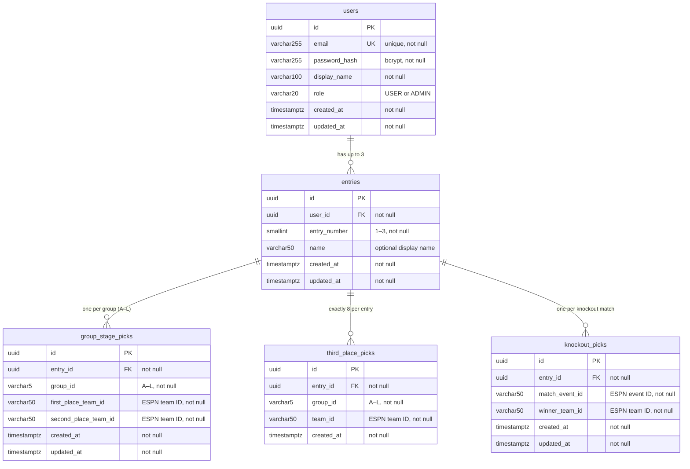

# World Cup App – Backend

Spring Boot REST API that proxies live World Cup data to the React frontend and persists user accounts, entries, and tournament picks in PostgreSQL. The ESPN data source is behind an interface so any provider can be swapped in without touching the controllers.

---

## Requirements

| Tool | Minimum Version |
|------|----------------|
| Java | 17 |
| Maven | 3.8 |
| PostgreSQL | 14 *(production/staging only – not needed for local dev)* |

No API keys are required for the default ESPN provider.

---

## Running Locally (no PostgreSQL required)

The `local` Spring profile replaces PostgreSQL with an H2 in-memory database and seeds two test accounts on startup. No environment variables are needed.

```bash
cd backend
mvn spring-boot:run -Dspring-boot.run.profiles=local
```

**IntelliJ:** Run config → Active profiles → `local`

The server starts on port **8080**. On startup the console prints:

```
Test credentials: player1@test.com / password  |  player2@test.com / password
```

`player1` has a full set of sample picks seeded. `player2` starts empty (useful for testing the blank state in the UI).

### H2 Browser Console

While running with the `local` profile, the H2 web console is available at:

```
http://localhost:8080/h2-console
```

| Field | Value |
|-------|-------|
| JDBC URL | `jdbc:h2:mem:worldcupapp` |
| User | `sa` |
| Password | *(leave empty)* |

---

## Running Against PostgreSQL

Set the following environment variables before starting, then run without a profile:

```bash
export DB_HOST=localhost
export DB_PORT=5432
export DB_NAME=worldcupapp
export DB_USERNAME=worldcupapp
export DB_PASSWORD=yourpassword
export JWT_SECRET=<base64-encoded-256-bit-key>

mvn spring-boot:run
```

Flyway runs automatically on startup and applies any pending migrations from `src/main/resources/db/migration/`.

### AWS Deployment

Pass the variables above via ECS task definition environment / secrets fields. For `JWT_SECRET`, store the value in AWS Secrets Manager and inject it as an environment variable through the ECS secrets field — no code changes required.

| Environment variable | Description |
|----------------------|-------------|
| `DB_HOST` | RDS endpoint hostname |
| `DB_PORT` | Database port (default `5432`) |
| `DB_NAME` | Database name |
| `DB_USERNAME` | Database user |
| `DB_PASSWORD` | Database password |
| `JWT_SECRET` | Base64-encoded HMAC-SHA key (≥ 256 bits) |
| `JWT_EXPIRATION_MS` | Token lifetime in ms (default `86400000` = 24 h) |

---

## Configuration Reference

| Property | Default | Description |
|----------|---------|-------------|
| `server.port` | `8080` | HTTP port |
| `app.cors.allowed-origins` | `http://localhost:3000` | Comma-separated allowed CORS origins |
| `app.espn.base-url` | ESPN site API URL | Base URL for scoreboard and match-summary endpoints |
| `app.espn.standings-url` | ESPN v2 standings URL | Separate URL for the standings endpoint |
| `app.jwt.secret` | Dev-only default | Base64-encoded HMAC-SHA signing key |
| `app.jwt.expiration-ms` | `86400000` | JWT lifetime (milliseconds) |

---

## API Endpoints

All endpoints are prefixed with `/api`.

### Public – no token required

| Method | Path | Description |
|--------|------|-------------|
| `POST` | `/api/auth/register` | Create account; returns JWT and user info |
| `POST` | `/api/auth/login` | Authenticate; returns JWT and user info |
| `GET` | `/api/groups` | All 12 groups with their member teams |
| `GET` | `/api/standings` | Current group-stage standings |
| `GET` | `/api/matches` | Scoreboard (scheduled, live, completed) |
| `GET` | `/api/matches/{eventId}/summary` | Goal and assist detail for a specific match |
| `GET` | `/api/tournament/status` | Current phase, live-match flag, next match date |
| `GET` | `/api/teams/athletes` | All athletes for every tournament team *(controller pending — available via provider today)* |

### Protected – `Authorization: Bearer <token>` required

#### Entries

| Method | Path | Description |
|--------|------|-------------|
| `GET` | `/api/entries` | List all entries for the authenticated user (max 3) |
| `POST` | `/api/entries` | Create a new entry; body: `{ "name": "My Squad" }` |

#### Picks (scoped to an entry)

| Method | Path | Description |
|--------|------|-------------|
| `GET` | `/api/entries/{entryId}/picks` | All picks for the given entry |
| `PUT` | `/api/entries/{entryId}/picks/groups` | Upsert 1st and 2nd place prediction for one group |
| `PUT` | `/api/entries/{entryId}/picks/third-place` | Replace the full set of 8 advancing third-place teams (one team per group) |
| `PUT` | `/api/entries/{entryId}/picks/knockout` | Upsert predicted winner for a knockout match |

---

## Request / Response Shapes

### Auth

**POST /api/auth/register** and **POST /api/auth/login**

Request:
```json
{ "email": "user@example.com", "password": "secret", "displayName": "Player One" }
```
*(login omits `displayName`)*

Response — `AuthResponse`:
```json
{ "token": "<jwt>", "userId": "<uuid>", "email": "user@example.com", "displayName": "Player One", "role": "USER" }
```

### Entries

**GET /api/entries** → `List<EntryResponse>`

```json
[{ "id": "<uuid>", "entryNumber": 1, "name": "My Main Squad", "createdAt": "2026-05-01T12:00:00Z" }]
```

**POST /api/entries** body: `{ "name": "My Second Entry" }` → `EntryResponse` (same shape as above)

### Picks

**GET /api/entries/{entryId}/picks** → `EntryPicksResponse`:

```json
{
  "entryId": "<uuid>",
  "entryNumber": 1,
  "name": "My Main Squad",
  "groupStagePicks": [
    { "id": "<uuid>", "groupId": "A", "firstPlaceTeamId": "359", "secondPlaceTeamId": "382",
      "createdAt": "...", "updatedAt": "..." }
  ],
  "thirdPlacePicks": [
    { "groupId": "G", "teamId": "191" },
    { "groupId": "H", "teamId": "627" }
  ],
  "knockoutPicks": [
    { "id": "<uuid>", "matchEventId": "694023", "winnerTeamId": "359",
      "createdAt": "...", "updatedAt": "..." }
  ]
}
```

**PUT /api/entries/{entryId}/picks/groups**
```json
{ "groupId": "A", "firstPlaceTeamId": "359", "secondPlaceTeamId": "382" }
```

**PUT /api/entries/{entryId}/picks/third-place** — must contain exactly 8 selections, one team per group (duplicate groups are rejected):
```json
{
  "picks": [
    { "groupId": "G", "teamId": "191" },
    { "groupId": "H", "teamId": "627" },
    { "groupId": "I", "teamId": "2869" },
    { "groupId": "J", "teamId": "628" },
    { "groupId": "K", "teamId": "654" },
    { "groupId": "L", "teamId": "208" },
    { "groupId": "A", "teamId": "449" },
    { "groupId": "B", "teamId": "482" }
  ]
}
```

**PUT /api/entries/{entryId}/picks/knockout**
```json
{ "matchEventId": "694023", "winnerTeamId": "359" }
```

---

## Architecture

```
controller/
  AuthController          POST /api/auth/register, /api/auth/login
  EntriesController       GET/POST /api/entries
  PicksController         GET/PUT /api/entries/{id}/picks/**
  GroupsController        GET /api/groups
  StandingsController     GET /api/standings
  MatchController         GET /api/matches, /api/matches/{id}/summary
  TournamentController    GET /api/tournament/status
service/
  UserService             registration, login, password hashing
  EntryService            entry CRUD, ownership verification, max-3 enforcement
  PickService             group/third-place/knockout pick upserts
repository/               Spring Data JPA repositories for all entities
model/
  User                    account – email, BCrypt hash, display name, role
  Entry                   one bracket per entry (up to 3 per user)
  GroupStagePick          predicted 1st and 2nd place per group per entry
  ThirdPlacePick          one row per advancing third-place team per entry
  KnockoutPick            predicted winner per knockout match per entry
  Role                    USER | ADMIN enum
dto/                      immutable Java records for all request and response bodies
  AthleteDto              id, display name, position, teamId (read-only, from ESPN)
security/
  JwtUtil                 token generation and validation (JJWT 0.12, HS512)
  JwtAuthenticationFilter stateless JWT request filter
  UserDetailsServiceImpl  loads User entity for Spring Security
  SecurityConfig          filter chain, CORS, public vs protected rules
config/
  WebConfig               CORS (delegates to SecurityConfig CorsConfigurationSource)
  RestClientConfig        shared RestClient bean for ESPN HTTP calls
  CacheConfig             Caffeine cache manager with per-cache TTLs
  DataInitializer         seeds test users when running with the local profile
  LocalSecurityConfig     permits /h2-console under the local profile
provider/
  WorldCupDataProvider    interface – swap ESPN for any other source
  espn/EspnApiClient      raw ESPN HTTP calls, Caffeine-cached
                          fetchTeamAthletes(teamId) – hits /teams/{id}/roster, cached 24 h
  espn/EspnWorldCupDataProvider  ESPN JSON → domain DTOs
                          getAllTeamAthletes() – iterates all groups/teams, returns List<AthleteDto>
db/migration/
  V1__create_users_table        users table
  V2__create_picks_tables       original user-scoped pick tables
  V3__create_entries_table      entries table (multi-entry support)
  V4__migrate_picks_to_entries  backfill + re-key pick tables to entries
  V5__add_group_id_to_third_place_picks  group_id column + one-per-group constraint
```

### Caching

Raw ESPN responses are cached in `EspnApiClient` using Caffeine:

| Cache | TTL | Rationale |
|-------|-----|-----------|
| `standings` | 5 min | Updates only after matches finish |
| `scoreboard` | 1 min | Needs to reflect live score changes |
| `matchSummary` | 5 min | Stable once a match ends |
| `teams` | 24 h | Team rosters are static during the tournament |

### Database schema



**Key constraints**

| Table | Unique constraint |
|-------|------------------|
| `users` | `email` |
| `entries` | `(user_id, entry_number)` |
| `group_stage_picks` | `(entry_id, group_id)` |
| `third_place_picks` | `(entry_id, team_id)` and `(entry_id, group_id)` |
| `knockout_picks` | `(entry_id, match_event_id)` |

---

## Frontend Integration

The React frontend (`frontend/`) connects to this backend via a shared axios instance (`src/api/client.js`).

### Live endpoints (wired to backend)

| Hook | Endpoint |
|------|----------|
| `useGroups()` | `GET /api/groups` |
| `useStandings()` | `GET /api/standings` |
| `useScoreboard()` | `GET /api/matches` |
| `useMatchSummary(id)` | `GET /api/matches/{id}/summary` |
| `useTournamentInfo()` | `GET /api/tournament/status` |
| `usePlayers()` | `GET /api/teams/athletes` |
| `AuthContext.login()` | `POST /api/auth/login` |
| `AuthContext.register()` | `POST /api/auth/register` |
| `EntryContext` (load) | `GET /api/entries` + `GET /api/entries/{id}/picks` |
| `EntryContext.createEntry()` | `POST /api/entries` |
| `EntryContext.saveGroupPick()` | `PUT /api/entries/{id}/picks/groups` |
| `EntryContext.saveThirdPlacePicks()` | `PUT /api/entries/{id}/picks/third-place` *(sent only when all 8 are selected)* |
| `EntryContext.saveBracketPick()` | `PUT /api/entries/{id}/picks/knockout` |

### Still mocked (no backend endpoint yet)

- `useLeaderboard()` – fantasy points leaderboard
- `EntryContext.saveFormation()` – formation selection
- `EntryContext.saveSquadPick()` – 11-player squad

---

## Local vs Production at a Glance

| | `local` profile (H2) | No profile (PostgreSQL) |
|---|---|---|
| Database | H2 in-memory, wiped on restart | PostgreSQL via env vars |
| Schema management | Hibernate `create-drop` | Flyway migrations |
| Seed data | 2 test users + picks | None |
| H2 Console | `http://localhost:8080/h2-console` | Disabled |
| Env vars required | None | `DB_*`, `JWT_SECRET` |

---

## Swapping in a Different Data Provider

1. Create a class that implements `WorldCupDataProvider`.
2. Annotate it with `@Service` and `@Primary` (remove `@Primary` from `EspnWorldCupDataProvider` first, or use Spring profiles).
3. Implement all six methods – no other files need to change.

```java
@Service
@Profile("mock")
public class MockWorldCupDataProvider implements WorldCupDataProvider { ... }
```

```bash
mvn spring-boot:run -Dspring-boot.run.profiles=mock
```
