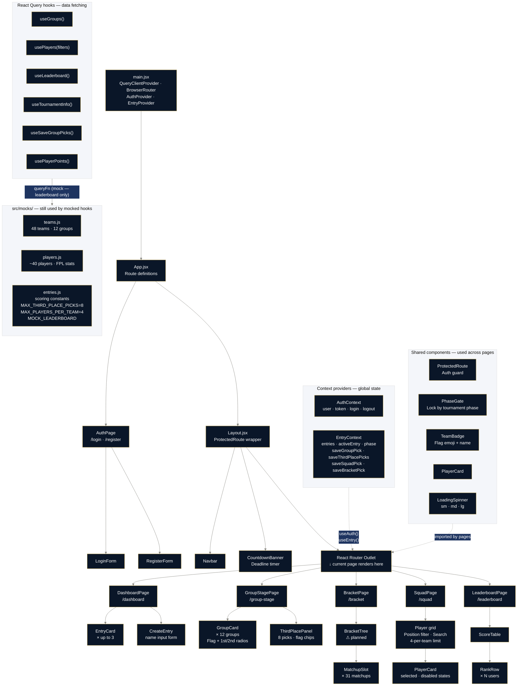

# World Cup Fantasy 2026 — Frontend

A React single-page application for picking World Cup brackets and fantasy player squads.

---

## Tech stack

| Tool | Purpose |
|------|---------|
| **React 18** | UI component library |
| **Vite** | Dev server and build tool (replaces Create React App) |
| **React Router v6** | Client-side routing (page navigation without full reloads) |
| **TanStack React Query** | Server-state management (data fetching, caching, refetching) |
| **Tailwind CSS** | Utility-first CSS framework |
| **date-fns** | Date formatting and countdown calculations |
| **Axios** | HTTP client for API calls (not yet wired — mocks used in dev) |
| **@sentry/react** | Frontend error tracking and session replay (disabled if `VITE_SENTRY_DSN` is unset) |

---

## Getting started

### Prerequisites
- Node.js 20 or later
- npm 10 or later

### Install dependencies
```bash
cd frontend
npm install
```

### Run the development server
```bash
npm run dev
```
Open [http://localhost:3000](http://localhost:3000). The app hot-reloads when you save files.

### Build for production
```bash
npm run build
```
Output goes to `dist/`. Deploy this folder to AWS S3 + CloudFront.

---

## Project structure

```
frontend/
├── index.html              # HTML entry point — React mounts into <div id="root">
├── vite.config.js          # Vite build config + dev server proxy to Java backend
├── tailwind.config.js      # Design tokens (colors, fonts, shadows)
├── src/
│   ├── main.jsx            # App entry — wraps everything in providers
│   ├── App.jsx             # Route definitions
│   ├── component-tree.mermaid  # Visual component diagram (see below)
│   ├── styles/
│   │   └── globals.css     # Global CSS + Tailwind directives + reusable classes
│   ├── pages/              # One component per route/page
│   ├── components/
│   │   └── shared/         # Components used across multiple pages
│   ├── context/            # Global state (auth, active entry)
│   ├── hooks/              # React Query data-fetching hooks
│   ├── mocks/              # Fake data that mimics backend API responses
│   └── utils/              # Pure helper functions (scoring math, formatting)
```

---

## Component tree

The diagram below shows how every component, context, hook, and mock file fits together. Render it with any Mermaid-compatible viewer (GitHub renders it natively in `.md` files; VS Code with the Mermaid extension; or paste into [mermaid.live](https://mermaid.live)).



The standalone `.mermaid` source lives at `src/component-tree.mermaid`.

---

## Game rules summary

### Group stage picks (lock at tournament kickoff — June 11, 2026)

| Pick | Points |
|------|--------|
| Correct group winner (×12) | +5 pts each |
| Correct group runner-up (×12) | +3 pts each |
| All 24 correct bonus | +20 pts |
| Correct 3rd-place qualifier (×8 picks) | +1 pt each |

**3rd-place picks:** In 2026, the 8 best third-place finishers advance to the R32. Users pick 8 teams they think will be among those qualifiers. Only one team per group may be selected.

### Squad picks (lock at tournament kickoff — June 11, 2026)

- Pick **Formation first** (1 GK): 3-5-2, 3-4-3, 4-5-1, 4-4-2, 4-3-3, 5-4-1, 5-3-2, 5-2-3
- Pick **11 players** based on formation selected
- **Max 4 players from any one national team**
- Players earn FPL-style points per match (goals, assists, clean sheets, etc.)
- Pick **11 starters** each round in a valid formation (1 GK · 3–5 DEF · 2–5 MID · 1–3 FWD)
- Auto-substitution applies if a starter does not play

### Bracket picks (lock at R32 kickoff)

| Round | Points per correct pick |
|-------|------------------------|
| Round of 32 | 1 pt |
| Round of 16 | 2 pts |
| Quarterfinal | 4 pts |
| Semifinal | 8 pts |
| Final | 16 pts |
| Champion | 32 pts |

### Entries

- Each user may create **up to 3 independent entries**
- Each entry has its own group picks, squad, and bracket — they score separately

---

## Mock data vs real API

Most hooks in `src/hooks/useGameData.js` are now wired to the live Spring Boot backend. The following hooks call real endpoints:

| Hook | Endpoint |
|------|----------|
| `useGroups()` | `GET /api/groups` |
| `useStandings()` | `GET /api/standings` |
| `useScoreboard()` | `GET /api/matches` |
| `useMatchSummary(id)` | `GET /api/matches/{id}/summary` |
| `useTournamentInfo()` | `GET /api/tournament/status` |
| `usePlayers(filters)` | `GET /api/teams/athletes` |
| `usePlayerPoints()` | `GET /api/players/points` |

The following hooks still return mock data until their backend endpoints are built:

| Hook | Status |
|------|--------|
| `useLeaderboard()` | Returns `MOCK_LEADERBOARD` from `src/mocks/entries.js` |
| `useSaveGroupPicks()` | Simulates a save; backend mutation not yet wired |

---

## Simulating different tournament phases

In production, the tournament phase is determined from the live backend (`GET /api/tournament/status` → `groupPicksOpen` / `bracketPicksOpen` flags). For local development you can override this with an environment variable instead of waiting for the real tournament calendar.

In `.env.local`, set:

```
VITE_DEV_PHASE=PRE_TOURNAMENT
```

| Value | Effect |
|-------|--------|
| `'PRE_TOURNAMENT'` | Group stage picks open, bracket/squad locked |
| `'GROUP_STAGE'` | Tournament underway, all picks locked |
| `'KNOCKOUT'` | Bracket picks open, group picks locked |

Remove or leave `VITE_DEV_PHASE` unset in production builds — the app will use the live phase from the backend.

---

## Key concepts for new React developers

### JSX
React components return JSX — HTML-like syntax compiled to JavaScript. Use `className` instead of `class`, and all tags must be closed.

### Props
Data passed from a parent component to a child. Like HTML attributes but for your own components. Props flow **down** only.

### State (`useState`)
Data that belongs to a component and can change. When state changes, React re-renders the component.

### Derived state (`useMemo`)
When a value can be computed from existing state, use `useMemo` to cache the result and only recompute when the source state changes. Used for `positionCounts` and `teamCounts` in `SquadPage`.

### Effects (`useEffect`)
Code that runs after a render and reaches outside the component (timers, API calls, DOM mutations). Always return a cleanup function if you start a timer or subscription.

### Context
Global state accessible by any component without prop drilling. We use it for auth (`useAuth()`) and active entry data (`useEntry()`).

### React Query
Manages fetched data (server state). Handles loading, errors, caching, and background refetches automatically.

---

## Environment variables

Copy `.env.example` to `.env.local` and fill in values:

```
# Required — Spring Boot backend URL (proxied by Vite in dev, set explicitly in prod)
VITE_API_BASE_URL=http://localhost:8080

# Optional — override the live tournament phase for local development
# Valid values: PRE_TOURNAMENT | GROUP_STAGE | KNOCKOUT
# VITE_DEV_PHASE=PRE_TOURNAMENT

# Optional — Sentry DSN for error tracking and session replay.
# Create a project at sentry.io and copy the DSN from Settings → Client Keys.
# Leave unset locally unless you want to test Sentry; set via GitHub Secret in CI for production builds.
# VITE_SENTRY_DSN=https://xxxxxxxxxxxxxxxx@oxxxxxx.ingest.sentry.io/xxxxxxx
```

All Vite environment variables must start with `VITE_` to be accessible in the browser. In production, `VITE_API_BASE_URL` is set to the backend CloudFront URL during the CI build step. `VITE_SENTRY_DSN` is injected by the CI workflow from a GitHub Actions secret.
